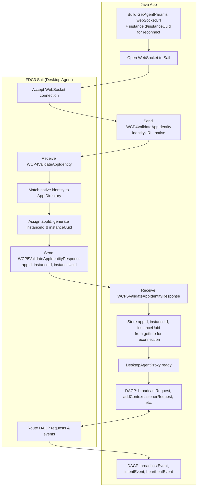

[](https://community.finos.org/docs/governance/Software-Projects/stages/incubating)

# FDC3 Java API

A Java implementation of the [FDC3 Standard](https://fdc3.finos.org/) enabling Java desktop applications to interoperate with other FDC3-enabled applications via the [Desktop Agent Communication Protocol (DACP)](https://fdc3.finos.org/docs/api/specs/desktopAgentCommunicationProtocol).



**App Identity flow:** For a new connection, the Java app sends `WCP4ValidateAppIdentity` with `identityURL: "native"`. FDC3 Sail looks up the app in its App Directory, assigns an `appId`, and generates `instanceId` and `instanceUuid` in the `WCP5ValidateAppIdentityResponse`. The app stores these (via `getInfo()`) for reconnection. On reconnect, the app includes the stored `instanceId` and `instanceUuid` in `WCP4`; Sail validates and returns the same `appId`. After handshake, all FDC3 API calls flow as DACP messages (requests, responses, events) over the WebSocket.

## Overview

This project provides:

- **FDC3 Standard API interfaces** — Java equivalents of the FDC3 TypeScript API
- **Desktop Agent Proxy** — Client-side implementation that communicates with a Desktop Agent over WebSocket
- **GetAgent factory** — Simple entry point for connecting to a Desktop Agent
- **Cucumber testing framework** — Shared step definitions for conformance testing against the official FDC3 feature files

## Modules

| Module             | Description                                                                     |
| ------------------ | ------------------------------------------------------------------------------- |
| `fdc3-standard`    | Core FDC3 API interfaces (`DesktopAgent`, `Channel`, `Context`, `Intent`, etc.) |
| `fdc3-schema`      | Generated schema types and JSON conversion utilities                            |
| `fdc3-context`     | Context type conversion utilities                                               |
| `fdc3-agent-proxy` | `DesktopAgentProxy` implementation using DACP messaging                         |
| `fdc3-get-agent`   | `GetAgent` factory for obtaining a `DesktopAgent` connection via WebSocket      |
| `fdc3-testing`     | Cucumber step definitions and test utilities for FDC3 conformance testing       |

## Requirements

- Java 11 or later
- Maven 3.6+
- A running FDC3 Desktop Agent that supports the [Desktop Agent Communication Protocol](https://fdc3.finos.org/docs/api/specs/desktopAgentCommunicationProtocol) (e.g., [FDC3 Sail](https://github.com/finos/FDC3-Sail))

## Installation

### Building from Source

```sh
mvn clean install
```

### Maven Dependency

Once published, add to your `pom.xml`:

```xml
<dependency>
    <groupId>org.finos.fdc3</groupId>
    <artifactId>fdc3-get-agent</artifactId>
    <version>1.0.0-SNAPSHOT</version>
</dependency>
```

## Usage

### Connecting to a Desktop Agent

````java
import org.finos.fdc3.getagent.GetAgent;
import org.finos.fdc3.getagent.GetAgentParams;
import org.finos.fdc3.api.DesktopAgent;
import java.util.UUID;

// Connect to a Desktop Agent via WebSocket
GetAgentParams params = GetAgentParams.builder()
    .webSocketUrl("ws://localhost:4475")           // Desktop Agent WebSocket URL (required)
    .instanceId(desktopAgentProvidedInstanceId)    // Unique instance ID (required)
    .instanceUuid(desktopAgentProvidedInstanceUuid)// Shared secret UUID (required)
    .channelSelector(myChannelSelector)            // Optional: custom ChannelSelector
    .intentResolver(myIntentResolver)              // Optional: custom IntentResolver
    .build();

DesktopAgent agent = GetAgent.getAgent(params).toCompletableFuture().get();

### Configuration via System Properties

The following system properties can be used to provide default values for `GetAgentParams`.
Values set via the builder will override these defaults.

| System Property       | Description                                      |
| --------------------- | ------------------------------------------------ |
| `FDC3_WEBSOCKET_URL`  | Default WebSocket URL for the Desktop Agent      |
| `FDC3_INSTANCE_ID`    | Instance ID for the application instance (if reconnecting)|
| `FDC3_INSTANCE_UUID`  | Instance ID UUID (shared secret) (if reconnecting)            |

This allows for simplified configuration when these values are provided externally:

```java
// If system properties are set, the builder can be used with minimal configuration
// e.g., java -DFDC3_WEBSOCKET_URL=ws://localhost:4475 -DFDC3_INSTANCE_ID=my-app ...
GetAgentParams params = GetAgentParams.builder()
    .channelSelector(myChannelSelector)  // Only set optional overrides
    .build();
```

### Broadcasting Context

```java
// Create and broadcast a context
Context contact = new Contact("jane@example.com", "Jane Smith");
agent.broadcast(contact);
````

### Listening for Context

```java
// Add a context listener
agent.addContextListener("fdc3.contact", context -> {
    System.out.println("Received contact: " + context);
});
```

### Raising Intents

```java
// Raise an intent (null app lets the resolver choose)
IntentResolution resolution = agent.raiseIntent("ViewChart", instrument, null)
    .toCompletableFuture().get();
```

## Contributing

1. Fork the repository (<https://github.com/finos/fdc3-java-api/fork>)
2. Create your feature branch (`git checkout -b feature/fooBar`)
3. Read our [contribution guidelines](.github/CONTRIBUTING.md) and [Community Code of Conduct](https://www.finos.org/code-of-conduct)
4. Commit your changes (`git commit -am 'Add some fooBar'`)
5. Push to the branch (`git push origin feature/fooBar`)
6. Create a new Pull Request

_NOTE:_ Commits and pull requests to FINOS repositories will only be accepted from those contributors with an active, executed Individual Contributor License Agreement (ICLA) with FINOS OR who are covered under an existing and active Corporate Contribution License Agreement (CCLA) executed with FINOS. Commits from individuals not covered under an ICLA or CCLA will be flagged and blocked by the FINOS Clabot tool. Please note that some CCLAs require individuals/employees to be explicitly named on the CCLA.

_Need an ICLA? Unsure if you are covered under an existing CCLA? Email [help@finos.org](mailto:help@finos.org)_

## License

Copyright 2026 Fintech Open Source Foundation (FINOS)

Distributed under the [Apache License, Version 2.0](http://www.apache.org/licenses/LICENSE-2.0).

SPDX-License-Identifier: [Apache-2.0](https://spdx.org/licenses/Apache-2.0)
